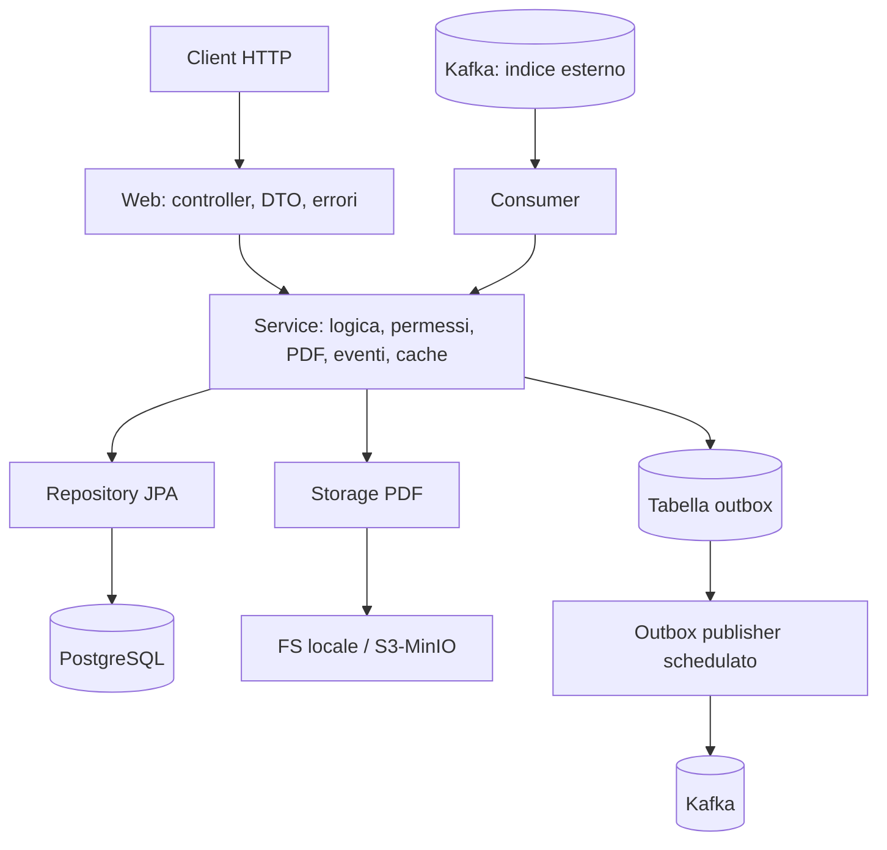

# Protocollo API

API REST di esempio per la **protocollazione di documenti**, costruita con Spring Boot.
Il progetto nasce come scheletro dimostrativo: mostra in modo compatto ma realistico
come mettere insieme autenticazione JWT, sicurezza, persistenza, messaggistica e test
in un'applicazione Java moderna.


[](https://github.com/VNZ93/protocollo-api/actions/workflows/ci.yml)

---

## Cosa mostra il progetto

| Ambito           | Tecnologia / approccio                                                        |
|------------------|------------------------------------------------------------------------------|
| Linguaggio       | Java 21                                                                       |
| Framework        | Spring Boot 3.3 (Web, Validation, Data JPA, Security, Cache, Actuator)        |
| Sicurezza        | Spring Security con **JWT** stateless, filter chain dedicata e **refresh token** |
| Autorizzazione   | Ruoli nel token, `@PreAuthorize` e `@AuthenticationPrincipal` per i permessi  |
| Persistenza      | Hibernate / JPA su **PostgreSQL**, ricerche dinamiche con Specification        |
| Migrazioni DB    | **Flyway** (schema versionato in SQL)                                         |
| Messaggistica    | **Kafka** con **pattern Outbox**: producer affidabile + **consumer** (indice) |
| Generazione file | **PDF** da **template HTML** (Flying Saucer) salvato su **object storage**     |
| Object storage   | Filesystem locale (profilo `dev`) o **S3/MinIO** (profilo `prod`)             |
| Integrazione     | **RestClient** verso un microservizio esterno con mappatura JSON resiliente    |
| Prestazioni      | **Cache** (Caffeine) sulle GET e **rate limiting** (token bucket) per IP       |
| Pattern          | Documentati in [docs/PATTERNS.md](docs/PATTERNS.md)                            |
| Documentazione   | **OpenAPI / Swagger UI**                                                      |
| Osservabilita    | Logging con id di correlazione (MDC) + Spring Boot Actuator                   |
| Test             | **JUnit 5**, **Mockito**, MockMvc e **Testcontainers** per l'integrazione     |
| Build & Deploy   | Maven, profili `dev`/`prod`, Dockerfile multi-stage, Docker Compose            |

---

## Architettura

L'applicazione e organizzata a livelli, con responsabilita separate. Il diagramma
seguente (Mermaid, reso automaticamente da GitHub) mostra il flusso principale:



In sintesi: il `web` riceve le richieste e delega al `service`, che applica le
regole di business e parla con `repository` (DB), `storage` (PDF) e con Kafka
tramite l'outbox. Un consumer separato riceve gli aggiornamenti dall'indice esterno.

```
src/main/java/dev/protocollo
├── ProtocolloApplication.java        punto di ingresso
├── config/                           security, openapi, kafka, cache, seeding
├── security/                         JWT, filtro, UserDetails, principal
├── web/                              controller REST, DTO, exception handler
├── service/                          logica applicativa (documenti, refresh token)
├── repository/                       repository JPA, Specification e filtri
├── domain/                           entita JPA ed enum
├── messaging/                        eventi e consumer Kafka
│   └── outbox/                       pattern Outbox (service + publisher)
├── pdf/                              generazione del PDF da template HTML
├── storage/                          object storage: interfaccia + locale + S3
├── client/                           client REST verso microservizi esterni
└── common/
    ├── logging/                      filtro di logging con id di correlazione
    └── ratelimit/                    filtro di rate limiting (token bucket)

src/main/resources
├── application.yml                   configurazione comune
├── application-dev.yml               profilo dev (storage locale)
├── application-prod.yml              profilo prod (storage S3/MinIO)
├── logback-spring.xml                formato dei log
├── templates/                        template HTML del PDF
└── db/migration/                     migrazioni Flyway (V1..V6)

docs/PATTERNS.md                      pattern e best practice usati nel progetto
```

---

## Documentazione

Oltre a questo README, nella cartella [`docs/`](docs) trovi (nell'ordine in
cui ha senso leggerli, dal "far partire il progetto" allo "studiarlo a fondo"):

1. **[SETUP.md](docs/SETUP.md)**: ambiente da zero (installazione JDK/Maven/
   Docker, Maven Wrapper), avvio, verifica end-to-end e pipeline CI su
   GitHub Actions. Parti da qui se devi clonare ed eseguire il progetto su
   una macchina nuova.
2. **[HLD.md](docs/HLD.md)**: progettazione ad alto livello (architettura, flussi,
   requisiti) con diagrammi.
3. **[LLD.md](docs/LLD.md)**: progettazione di dettaglio (sequenze, schema DB,
   contratti API, configurazione).
4. **[PATTERNS.md](docs/PATTERNS.md)**: pattern e best practice usati, con riferimenti
   ai file.
5. **[GUIDA-COMPLETA.md](docs/GUIDA-COMPLETA.md)**: compendio di studio che spiega il
   progetto dall'inizio alla fine, classe per classe e metodo per metodo
   (include anche FAQ ed esecuzione/troubleshooting a livello applicativo).

---

## Avvio rapido

### Prerequisiti
- JDK 21
- Maven 3.9+ (oppure nessuno: usa il **Maven Wrapper** incluso — `./mvnw` su
  Linux/macOS, `mvnw.cmd` su Windows — che scarica Maven da solo al primo
  utilizzo; vedi [docs/SETUP.md](docs/SETUP.md))
- Docker (per l'infrastruttura locale e per i test di integrazione)

> Se parti da una macchina senza nessuno di questi strumenti installato,
> [docs/SETUP.md](docs/SETUP.md) descrive passo per passo come installarli
> (anche su Windows con winget) e come e stata creata la pipeline CI.

### 1. Avvia l'infrastruttura (PostgreSQL + Kafka)

```bash
docker compose up -d
```

Questo avvia PostgreSQL (porta 5432), Kafka (porta 9092), una Kafka UI su
http://localhost:8081 per ispezionare i messaggi e MinIO (object storage) con
console su http://localhost:9001 (utente/password: `minioadmin`).

### 2. Avvia l'applicazione

```bash
mvn spring-boot:run
# oppure, senza Maven installato globalmente:
./mvnw spring-boot:run        # Linux/macOS
mvnw.cmd spring-boot:run      # Windows
```

L'applicazione parte su http://localhost:8080. All'avvio:
- Flyway crea lo schema e inserisce i documenti di esempio;
- vengono creati due utenti di prova (vedi sotto).

### In alternativa: tutto in Docker

```bash
docker compose --profile app up -d --build
```

Avvia infrastruttura **e** applicazione, gia configurate per comunicare tra loro.
In questa modalita l'app gira in profilo `prod` e usa MinIO come object storage.

---

## Utenti di esempio

Creati automaticamente al primo avvio (password cifrate con BCrypt):

| Username | Password      | Ruoli         |
|----------|---------------|---------------|
| `admin`  | `admin123`    | ADMIN, USER   |
| `mrossi` | `password123` | USER          |

---

## Come si usa l'API

### 1. Login per ottenere il token

```bash
curl -X POST http://localhost:8080/api/auth/login \
  -H "Content-Type: application/json" \
  -d '{"username":"admin","password":"admin123"}'
```

Risposta (access token di breve durata + refresh token revocabile):

```json
{
  "accessToken": "eyJhbGciOi...",
  "refreshToken": "0b5f...-uuid",
  "tipo": "Bearer",
  "nome": "Amministratore di sistema"
}
```

### 2. Chiamare gli endpoint protetti con il token

```bash
TOKEN="incolla-qui-il-token"

# Elenco documenti
curl http://localhost:8080/api/documenti -H "Authorization: Bearer $TOKEN"

# Creazione (genera un evento Kafka di protocollazione)
curl -X POST http://localhost:8080/api/documenti \
  -H "Authorization: Bearer $TOKEN" \
  -H "Content-Type: application/json" \
  -d '{"titolo":"Determina X","contenuto":"..."}'
```

Trovi tutte le chiamate pronte all'uso anche nel file [`api.http`](api.http).

### Endpoint disponibili

| Metodo | Percorso                  | Descrizione                          | Permessi              |
|--------|---------------------------|--------------------------------------|-----------------------|
| POST   | `/api/auth/login`         | Login, restituisce access + refresh  | pubblico              |
| POST   | `/api/auth/refresh`       | Nuova coppia di token (con rotazione)| pubblico              |
| POST   | `/api/auth/logout`        | Revoca il refresh token              | pubblico              |
| GET    | `/api/documenti`          | Elenco paginato e filtrabile         | autenticato           |
| GET    | `/api/documenti/{id}`     | Dettaglio singolo (con cache)        | autenticato           |
| GET    | `/api/documenti/{id}/pdf` | Scarica il PDF dallo storage         | autenticato           |
| POST   | `/api/documenti`          | Crea + genera PDF + evento Kafka     | ruolo USER o ADMIN    |
| PUT    | `/api/documenti/{id}`     | Aggiorna + rigenera PDF + evento     | proprietario o ADMIN  |
| GET    | `/api/anagrafica/{user}`  | Dati anagrafici da microservizio esterno | autenticato       |

L'elenco supporta paginazione, ordinamento e filtri facoltativi, ad esempio:
`GET /api/documenti?stato=PROTOCOLLATO&proprietario=mrossi&testo=determina&page=0&size=10&sort=dataCreazione,desc`

### Documentazione interattiva (Swagger)

Con l'applicazione avviata: http://localhost:8080/swagger-ui.html
Usa il pulsante **Authorize** per inserire il token e provare gli endpoint dal browser.

---

## Come funziona l'autenticazione JWT

1. Il client invia username e password a `/api/auth/login`.
2. `AuthController` delega a Spring Security la verifica delle credenziali e, se
   valide, `JwtService` genera un token firmato (HMAC-SHA256) con ruoli e nome.
3. A ogni richiesta successiva il client invia l'header
   `Authorization: Bearer <token>`.
4. Il `JwtAuthenticationFilter` intercetta la richiesta, valida il token,
   ricarica l'utente dal database e popola il `SecurityContext`.
5. I controller leggono l'utente con `@AuthenticationPrincipal` e l'autorizzazione
   e gestita da `@PreAuthorize` (a grana grossa) e dalla logica del service
   (controllo del proprietario, a grana fine).

L'autenticazione e **stateless**: non esiste sessione lato server, lo stato vive
interamente nel token.

### Access token e refresh token

- L'**access token** e uno JWT di breve durata (default 60 minuti), stateless.
- Il **refresh token** e un token opaco di lunga durata (default 7 giorni),
  **persistito sul database** e quindi revocabile. Si usa su `/api/auth/refresh`
  per ottenere un nuovo access token senza rifare il login.
- A ogni refresh il token viene **ruotato**: il precedente e revocato e ne viene
  emesso uno nuovo, riducendo la finestra di rischio in caso di furto. Il logout
  (`/api/auth/logout`) revoca il refresh token.

---

## Eventi Kafka

Alla creazione e all'aggiornamento di un documento viene pubblicato un evento sul
topic `protocollo.documenti.protocollazione`. La pubblicazione usa il **pattern
Outbox** (vedi sotto): l'evento viene prima scritto su una tabella, nella stessa
transazione del documento, e inviato a Kafka in un secondo momento.

Esempio di messaggio (JSON):

```json
{
  "idDocumento": 3,
  "titolo": "Determina X",
  "numeroProtocollo": "PRT-2026-000003",
  "proprietario": "admin",
  "pdfRiferimento": "documenti/PRT-2026-000003.pdf",
  "operazione": "CREAZIONE",
  "timestamp": "2026-06-07T10:15:30Z"
}
```

Puoi vedere i messaggi nella Kafka UI su http://localhost:8081.

### Consumer: aggiornamenti dall'indice esterno

Un consumer (`IndiceConsumer`) ascolta il topic
`protocollo.indice.aggiornamenti`: simula un indice/sistema esterno che, dopo aver
rielaborato una risorsa, segnala un cambio di stato. Il consumer allinea il
documento locale (aggiorna lo stato, lo marca come indicizzato) e invalida la cache.

Per provarlo, pubblica un messaggio sul topic (ad esempio dalla Kafka UI):

```json
{ "idDocumento": 1, "nuovoStato": "ARCHIVIATO", "origine": "motore-indicizzazione" }
```

Il deserializzatore e protetto da un `ErrorHandlingDeserializer`: un messaggio
malformato viene scartato senza bloccare il consumo.

### Pattern Outbox (pubblicazione affidabile)

Pubblicare su Kafka direttamente dal service avrebbe un problema: se il commit sul
DB e l'invio del messaggio non sono atomici, si rischia di salvare il documento ma
perdere l'evento (o viceversa). Per evitarlo si usa il **Transactional Outbox**:

1. il service scrive l'evento nella tabella `outbox_event` nella **stessa
   transazione** del documento ([OutboxService](src/main/java/dev/protocollo/messaging/outbox/OutboxService.java));
2. un publisher schedulato legge gli eventi non ancora inviati, li pubblica su
   Kafka e li marca come pubblicati ([OutboxPublisher](src/main/java/dev/protocollo/messaging/outbox/OutboxPublisher.java)).

La consegna e "at-least-once": un evento viene marcato pubblicato solo dopo
l'invio confermato (i consumer devono quindi essere idempotenti).

---

## Integrazione con un microservizio esterno

L'endpoint `GET /api/anagrafica/{username}` mostra come chiamare un altro
microservizio (ipotetico) con `RestClient` e gestirne la risposta in modo
**resiliente** ([AnagraficaClient](src/main/java/dev/protocollo/client/AnagraficaClient.java)).

Invece di legarci a una classe che rispecchia esattamente il JSON remoto, leggiamo
un `JsonNode` ed estraiamo i campi con `path()` e nomi alternativi (es. `nome`
oppure `firstName`, `email` in radice o dentro `contatti`). Cosi, se il servizio
esterno cambia o rinomina un campo, ci adattiamo in un solo punto senza rompere il
resto dell'applicazione. Il risultato viene mappato sul nostro DTO stabile
`DatiAnagrafici`.

Essendo il servizio esterno solo ipotetico, senza un endpoint reale la chiamata
risponde `502 Bad Gateway` (gestito centralmente): e il comportamento atteso.

---

## Generazione PDF e object storage (profili dev / prod)

Alla creazione (e a ogni aggiornamento) di un documento viene generato un **PDF di
accreditamento** e salvato su un object storage tramite l'interfaccia
`DocumentStorage`. Il riferimento al file viene memorizzato sul documento ed e
scaricabile da `GET /api/documenti/{id}/pdf`.

Il PDF nasce da un **template HTML** ([documento-accreditamento.html](src/main/resources/templates/documento-accreditamento.html))
con segnaposto `${...}` che vengono riempiti a runtime (Flying Saucer rende
l'XHTML in PDF). Il documento mostra in modo dinamico nome e cognome dell'utente,
email e la lista dei **servizi a cui e accreditato**, configurabili in
`application.yml` (`app.accreditamento.servizi`). Tenere il layout in un template,
fuori dal codice Java, permette di cambiarne la grafica senza ricompilare.

L'implementazione dello storage cambia in base al **profilo Spring attivo**:

| Profilo | Implementazione         | Dove finiscono i PDF                          |
|---------|-------------------------|-----------------------------------------------|
| `dev`   | `LocalFileSystemStorage`| cartella locale (`app.storage.local.directory`)|
| `prod`  | `S3ObjectStorage`       | bucket S3 / MinIO (`app.storage.s3.*`)        |

Il profilo predefinito e `dev`. Per usare lo storage S3:

```bash
SPRING_PROFILES_ACTIVE=prod mvn spring-boot:run
```

(con `docker compose --profile app up` l'app gira gia in `prod` verso MinIO).
Grazie all'astrazione, la logica di business non sa quale storage e in uso: si
cambia backend semplicemente cambiando profilo.

---

## Cache e rate limiting

- **Cache** (Caffeine): la lettura del singolo documento (`GET /api/documenti/{id}`)
  e messa in cache e invalidata automaticamente a ogni aggiornamento. La prima
  lettura interroga il DB (cache miss), le successive no.
- **Rate limiting**: un filtro applica un limite di richieste per indirizzo IP con
  algoritmo "token bucket" (configurabile via `app.rate-limit.*`). Oltre il limite
  risponde `429 Too Many Requests`. Documentazione e health check sono esclusi.

---

## Test

Il progetto distingue tra test veloci (unitari) e test di integrazione.

```bash
# Solo unit test (veloci, non serve Docker)
mvn test

# Unit test + test di integrazione con Testcontainers (serve Docker attivo)
mvn verify
```

- **Unit test** (`*Test`): `JwtServiceTest`, `DocumentoServiceTest` (Mockito, copre
  anche PDF/storage e l'aggiornamento da indice), `DocumentoControllerTest`
  (MockMvc sul solo livello web).
- **Test di integrazione** (`*IT`): `DocumentoIntegrationIT` avvia PostgreSQL e
  Kafka reali con Testcontainers ed esercita l'intero flusso: login, creazione
  (con generazione PDF), aggiornamento, download del PDF e refresh del token.

Ad ogni push/PR su `main` una pipeline **GitHub Actions** esegue `mvn verify`
(quindi entrambe le categorie di test): vedi
[`.github/workflows/ci.yml`](.github/workflows/ci.yml) e i dettagli in
[docs/SETUP.md](docs/SETUP.md#4-pipeline-ci-github-actions).

---

## Scelte tecniche

- **DTO separati dalle entita**: il modello di persistenza non viene esposto
  direttamente all'esterno.
- **`ddl-auto: validate`**: lo schema e gestito solo da Flyway; Hibernate si limita
  a verificare la corrispondenza con le entita, senza modificare il database.
- **Lock ottimistico** (`@Version`) sui documenti per gestire le modifiche concorrenti.
- **Gestione errori centralizzata** con `@RestControllerAdvice` e risposte in
  formato `ProblemDetail` (RFC 7807).
- **Niente Lombok**: il codice e volutamente esplicito (record per i DTO,
  getter/setter sulle entita) per restare leggibile a chi lo studia.

---

## Pattern e best practice

Il progetto usa diversi pattern di programmazione "classici" dove emergono in modo
naturale: Strategy (storage intercambiabile), Adapter (`UtenteAutenticato`),
Factory method, Template Method (i filtri), Repository, DTO, Specification e
Transactional Outbox, oltre a Dependency Injection e Singleton dei bean Spring.

Sono spiegati uno per uno, con riferimento ai file, in
**[docs/PATTERNS.md](docs/PATTERNS.md)**.

---

## Possibili estensioni

Spunti per chi volesse ampliare l'esempio: rate limiting distribuito (es. Redis
condiviso tra istanze), URL prefirmati per il download diretto dei PDF dallo
storage, dispatch generico dell'outbox su piu tipi di evento, pipeline CI/CD e
manifest Kubernetes.

---

Progetto dimostrativo a scopo didattico e di portfolio.
