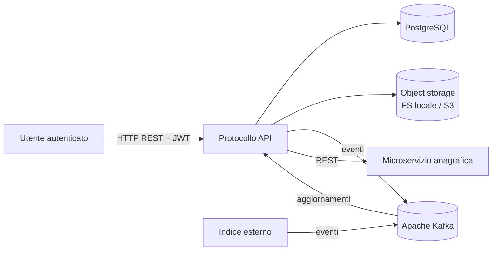
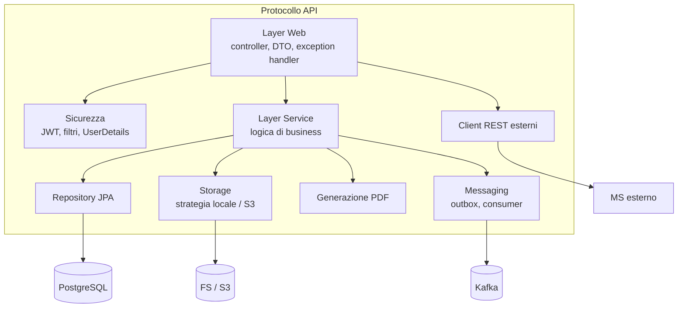
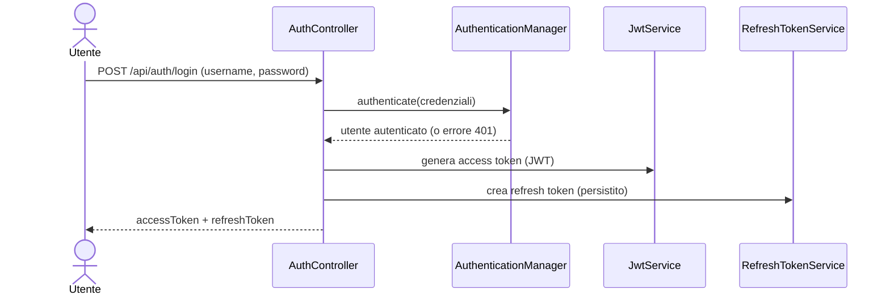
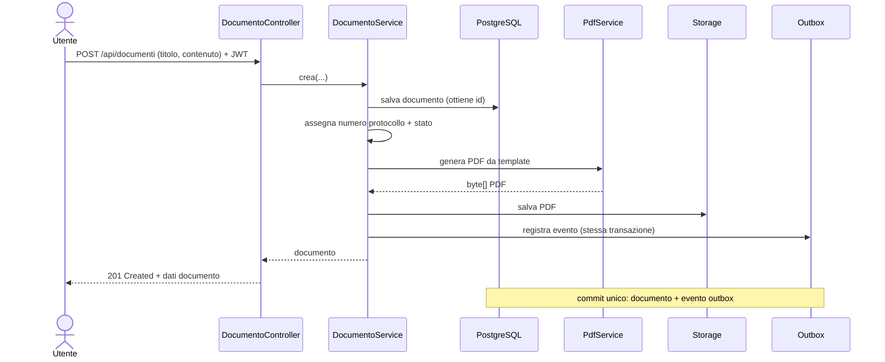
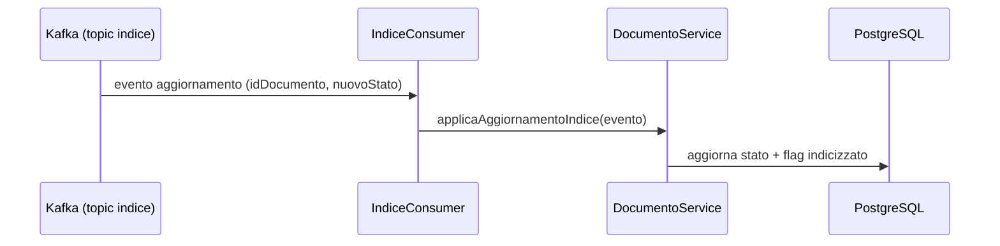
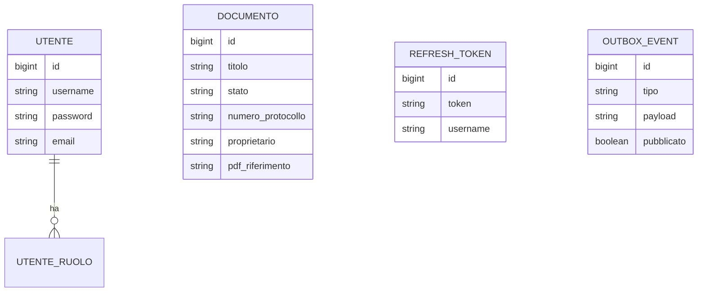

# High Level Design (HLD) - Protocollo API

Documento di progettazione ad alto livello. Descrive scopo, contesto,
architettura, flussi principali e scelte tecnologiche del sistema, senza entrare
nei dettagli implementativi (per quelli vedi [LLD.md](LLD.md)).

---

## 1. Scopo del sistema

Protocollo API e un servizio backend REST per la **protocollazione di documenti**:
permette di creare documenti, assegnare loro un numero di protocollo, generarne
una versione PDF, consultarli e aggiornarli, notificando i sistemi a valle tramite
eventi su una coda di messaggi.

E un progetto dimostrativo: l'obiettivo e mostrare un'architettura backend
realistica e completa (sicurezza, persistenza, messaggistica, storage, test).

---

## 2. Contesto e attori

**Attori:**
- **Utente** (ruolo USER o ADMIN): consuma le API REST autenticandosi con JWT.
- **Indice esterno**: sistema che pubblica aggiornamenti su Kafka, consumati dall'API.
- **Microservizio anagrafica**: servizio terzo interrogato via REST per dati utente.

---

## 3. Requisiti funzionali

| Codice | Requisito |
|--------|-----------|
| RF-01  | Autenticazione utente con credenziali, rilascio di access + refresh token |
| RF-02  | Rinnovo dell'access token tramite refresh token (con rotazione) e logout |
| RF-03  | Creazione di un documento con numero di protocollo e PDF |
| RF-04  | Consultazione di un documento e del relativo PDF |
| RF-05  | Elenco paginato dei documenti con filtri (stato, proprietario, testo, date) |
| RF-06  | Aggiornamento di un documento (solo proprietario o amministratore) |
| RF-07  | Pubblicazione di un evento a ogni creazione/aggiornamento |
| RF-08  | Allineamento dei documenti agli aggiornamenti dell'indice esterno |
| RF-09  | Recupero dati anagrafici da un microservizio esterno |

## 4. Requisiti non funzionali

| Categoria | Requisito |
|-----------|-----------|
| Sicurezza | Password cifrate (BCrypt), API stateless con JWT, autorizzazione per ruolo e proprietario |
| Affidabilita | Eventi pubblicati in modo affidabile (pattern Outbox), consegna at-least-once |
| Prestazioni | Cache sulle letture frequenti, rate limiting per IP |
| Manutenibilita | Architettura a livelli, DTO separati, configurazione esternalizzata |
| Osservabilita | Log con id di correlazione, endpoint Actuator di health/metrics |
| Portabilita | Containerizzazione Docker, profili dev/prod |
| Testabilita | Unit test isolati (mock) + test di integrazione (Testcontainers) |

---

## 5. Vista architetturale (componenti)

I livelli dipendono solo verso il basso (web -> service -> repository). Le
dipendenze esterne (DB, storage, Kafka, MS) sono raggiunte tramite componenti
dedicati, cosi da poterle sostituire o simulare facilmente.

---

## 6. Stack tecnologico

- **Linguaggio/Runtime**: Java 21
- **Framework**: Spring Boot 3.3 (Web, Security, Data JPA, Cache, Actuator)
- **Persistenza**: Hibernate/JPA, PostgreSQL, migrazioni Flyway
- **Sicurezza**: Spring Security, JWT (JJWT), BCrypt
- **Messaggistica**: Apache Kafka (Spring for Kafka)
- **PDF**: template XHTML reso con Flying Saucer (OpenPDF)
- **Object storage**: filesystem locale (dev) o S3/MinIO (prod, AWS SDK v2)
- **Cache**: Caffeine
- **Documentazione API**: OpenAPI/Swagger (springdoc)
- **Test**: JUnit 5, Mockito, Testcontainers
- **Build/Deploy**: Maven, Docker, Docker Compose

---

## 7. Flussi principali

### 7.1 Autenticazione (login)

### 7.2 Creazione documento (con PDF e outbox)

L'evento viene poi inviato a Kafka, in modo asincrono, dal publisher dell'outbox.

### 7.3 Consumo aggiornamenti dall'indice esterno

---

## 8. Modello dati (alto livello)

Il legame tra `DOCUMENTO` e `UTENTE` e logico (campo `proprietario` = username),
non una foreign key: i documenti restano validi anche se l'utenza cambia.

---

## 9. Sicurezza

- **Autenticazione**: stateless via JWT firmato (HMAC-SHA256). Nessuna sessione.
- **Access token** breve (minuti) + **refresh token** lungo e revocabile (DB).
- **Autorizzazione**: per ruolo (`@PreAuthorize`) e per proprietario (nel service).
- **Password**: salvate solo come hash BCrypt.
- **Difese**: rate limiting per IP, gestione errori che non espone dettagli interni.

## 10. Osservabilita

- Log con **id di correlazione** (MDC, header `X-Request-Id`) per seguire una
  richiesta tra tutte le sue righe di log.
- **Actuator**: `/actuator/health`, `/actuator/metrics`, `/actuator/info`.

## 11. Deployment

- **Sviluppo**: profilo `dev` (storage su filesystem). Infrastruttura via Docker
  Compose (PostgreSQL, Kafka, MinIO).
- **Produzione**: profilo `prod` (storage su S3/MinIO). Immagine Docker
  multi-stage, configurazione via variabili d'ambiente. Adatta a Kubernetes/
  OpenShift grazie agli endpoint di health.

## 12. Scelte architetturali e trade-off

| Scelta | Motivazione | Trade-off |
|--------|-------------|-----------|
| Outbox per gli eventi | Atomicita tra dato ed evento | Latenza di pubblicazione (polling) |
| `ddl-auto: validate` + Flyway | Schema versionato e controllato | Le entita devono restare allineate |
| Storage dietro interfaccia | Cambiare backend per profilo | Un livello di astrazione in piu |
| JWT stateless | Scalabilita orizzontale | Revoca solo via refresh token |
| Cache in memoria (Caffeine) | Semplicita | Non condivisa tra istanze |

## 13. Glossario

- **Protocollazione**: assegnazione di un numero identificativo a un documento.
- **Access token**: JWT di breve durata per autorizzare le richieste.
- **Refresh token**: token a lunga durata per rinnovare l'access token.
- **Outbox**: tabella di appoggio per pubblicare eventi in modo affidabile.
- **Idempotenza**: proprieta per cui ripetere un'operazione non cambia il risultato.
