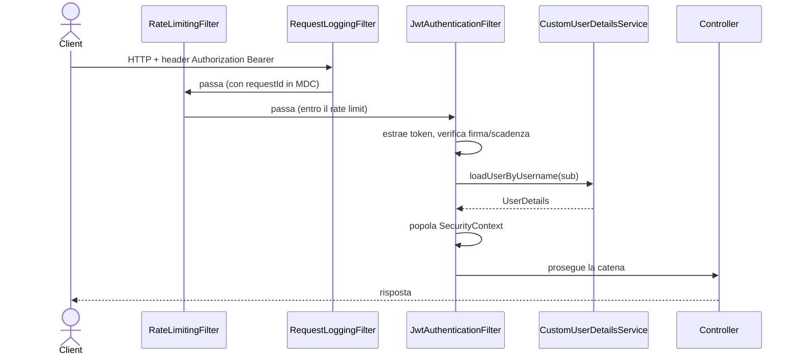
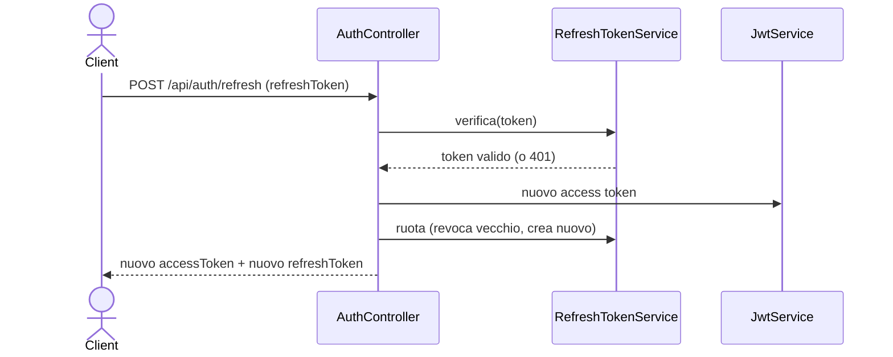
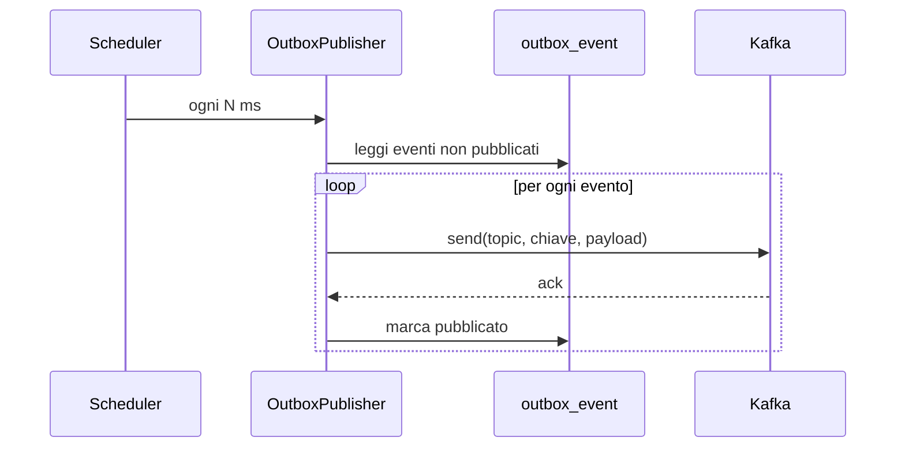
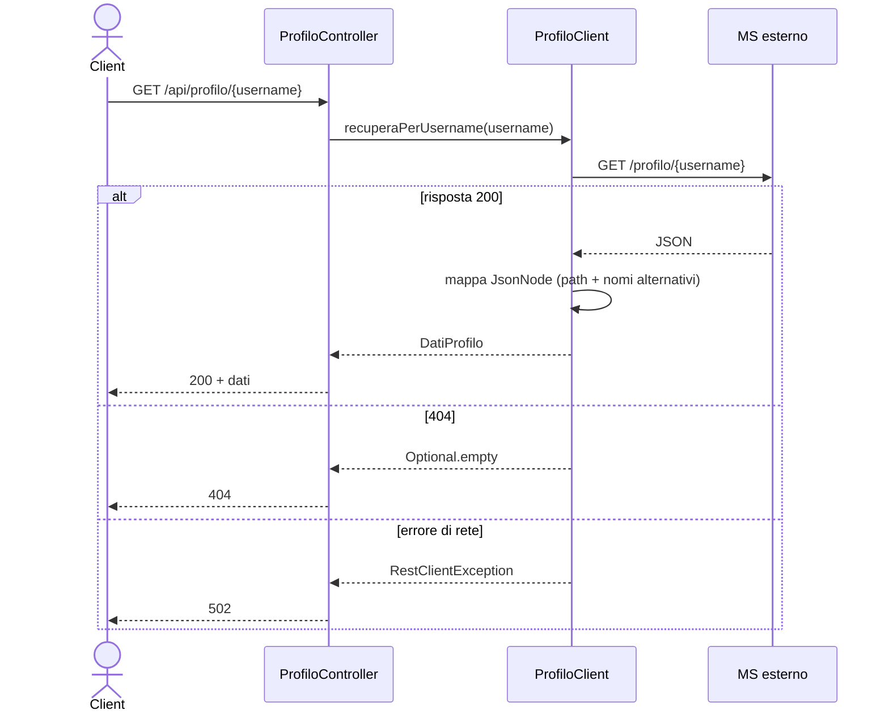
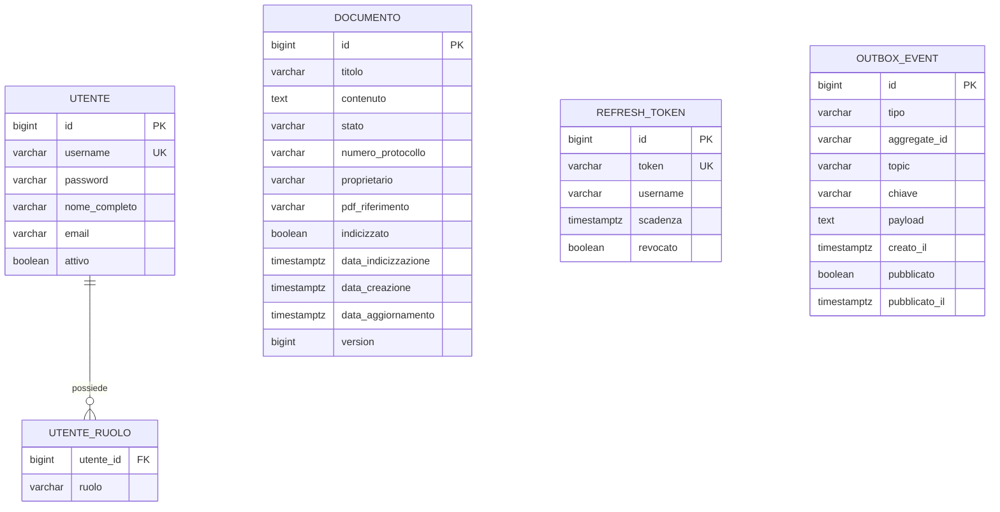

# Low Level Design (LLD) - Protocollo API

Documento di progettazione di dettaglio. Presuppone la lettura dell'[HLD](HLD.md).
Per la spiegazione classe-per-classe e riga-per-riga vedi invece la
[GUIDA-COMPLETA](GUIDA-COMPLETA.md).

---

## 1. Mappa dei package

```
dev.protocollo
├── ProtocolloApplication        avvio, abilita scheduling/config-properties/page-dto
├── config                       configurazioni (security, cache, openapi, kafka, restclient, seeder, properties)
├── security                     JwtService, JwtAuthenticationFilter, UserDetails, principal
├── web                          controller REST, DTO, GlobalExceptionHandler
│   └── dto                      record di richiesta/risposta
├── service                      DocumentoService, RefreshTokenService, eccezioni
├── repository                   repository JPA, Specification, record di filtro
├── domain                       entita JPA (Documento, Utente, RefreshToken, OutboxEvent) ed enum
├── messaging                    eventi, IndiceConsumer
│   └── outbox                   OutboxService, OutboxPublisher
├── pdf                          DocumentoPdfService, DatiAccreditamento
├── storage                      DocumentStorage + Local + S3 + config
├── client                       ProfiloClient, DatiProfilo
└── common
    ├── logging                  RequestLoggingFilter
    └── ratelimit                RateLimitingFilter
```

---

## 2. Dettaglio dei componenti

### 2.1 Web
- **AuthController**: `/api/auth/login|refresh|logout`. Orchestra autenticazione,
  emissione JWT e gestione refresh token.
- **DocumentoController**: CRUD documenti + download PDF. Riceve il principal con
  `@AuthenticationPrincipal`, applica `@PreAuthorize` per i ruoli.
- **ProfiloController**: `/api/profilo/{username}`, delega al client esterno.
- **GlobalExceptionHandler**: `@RestControllerAdvice`, mappa le eccezioni su
  `ProblemDetail` (RFC 7807).

### 2.2 Service
- **DocumentoService**: regole di business, transazioni, cache, generazione PDF,
  registrazione eventi nell'outbox.
- **RefreshTokenService**: creazione, verifica, rotazione e revoca dei refresh token.

### 2.3 Security
- **JwtService**: genera/valida i JWT (HMAC-SHA256).
- **JwtAuthenticationFilter**: estrae e valida il token, popola il SecurityContext.
- **CustomUserDetailsService**: carica l'utente dal DB.
- **UtenteAutenticato**: adatta `Utente` a `UserDetails` (principal).
- **SecurityConfig**: filter chain stateless, regole di autorizzazione, bean di supporto.

### 2.4 Persistenza
- **Repository**: `DocumentoRepository` (+ Specification), `UtenteRepository`,
  `RefreshTokenRepository`, `OutboxEventRepository`.
- **Domain**: entita JPA con mapping verso le tabelle gestite da Flyway.

### 2.5 Messaging
- **OutboxService**: scrive l'evento nella tabella outbox (transazione del service).
- **OutboxPublisher**: `@Scheduled`, invia gli eventi a Kafka e li marca pubblicati.
- **IndiceConsumer**: `@KafkaListener` sugli aggiornamenti dell'indice esterno.

### 2.6 PDF, Storage, Client
- **DocumentoPdfService**: riempie un template XHTML e lo rende in PDF.
- **DocumentStorage** (Strategy): `LocalFileSystemStorage` (dev) / `S3ObjectStorage` (prod).
- **ProfiloClient**: chiama il MS esterno via RestClient, mappa il JsonNode.

### 2.7 Common
- **RequestLoggingFilter**: id di correlazione in MDC, log di metodo/URI/stato/durata.
- **RateLimitingFilter**: token bucket per IP, risponde 429 oltre soglia.

---

## 3. Diagrammi di sequenza di dettaglio

### 3.1 Richiesta autenticata (validazione JWT)



### 3.2 Refresh token (con rotazione)



### 3.3 Outbox publisher



### 3.4 Profilo esterno (mappatura resiliente)



---

## 4. Schema del database



Le tabelle sono create dalle migrazioni Flyway `V1..V6`. Hibernate gira in
`validate`: verifica la corrispondenza con le entita, non modifica lo schema.

---

## 5. Contratti API

Tutte le rotte tranne `/api/auth/**`, Swagger e `/actuator/health` richiedono
l'header `Authorization: Bearer <accessToken>`.

| Metodo | Path | Body richiesta | Risposta | Codici |
|--------|------|----------------|----------|--------|
| POST | `/api/auth/login` | `{username, password}` | `{accessToken, refreshToken, tipo, nome}` | 200, 400, 401 |
| POST | `/api/auth/refresh` | `{refreshToken}` | `{accessToken, refreshToken, tipo, nome}` | 200, 401 |
| POST | `/api/auth/logout` | `{refreshToken}` | (vuoto) | 204 |
| GET | `/api/documenti` | - (query: stato, proprietario, testo, creatoDa, creatoA, page, size, sort) | pagina di documenti | 200, 401 |
| GET | `/api/documenti/{id}` | - | documento | 200, 401, 404 |
| GET | `/api/documenti/{id}/pdf` | - | PDF (binario) | 200, 401, 404 |
| POST | `/api/documenti` | `{titolo, contenuto}` | documento creato | 201, 400, 401, 403 |
| PUT | `/api/documenti/{id}` | `{titolo, contenuto}` | documento aggiornato | 200, 400, 401, 403, 404 |
| GET | `/api/profilo/{username}` | - | dati di profilo | 200, 401, 404, 502 |

---

## 6. Configurazione

Chiavi principali (`application.yml` + profili):

| Chiave | Significato | Default |
|--------|-------------|---------|
| `spring.profiles.active` | profilo attivo | `dev` |
| `app.jwt.secret` | chiave di firma JWT | (placeholder dev) |
| `app.jwt.expiration-minutes` | durata access token | 60 |
| `app.jwt.refresh-expiration-days` | durata refresh token | 7 |
| `app.kafka.topic-protocollazione` | topic eventi in uscita | protocollo.documenti.protocollazione |
| `app.kafka.topic-indice` | topic aggiornamenti in ingresso | protocollo.indice.aggiornamenti |
| `app.outbox.polling-delay` | intervallo publisher outbox (ms) | 5000 |
| `app.rate-limit.capacity` | gettoni massimi per IP | 100 |
| `app.rate-limit.refill-per-minute` | ricarica gettoni/minuto | 100 |
| `app.accreditamento.servizi` | servizi mostrati nel PDF | lista in yml |
| `app.servizio-profilo.base-url` | URL MS esterno | http://localhost:9099 |
| `app.storage.local.directory` | cartella PDF (dev) | tmp |
| `app.storage.s3.*` | endpoint/bucket/credenziali S3 (prod) | MinIO locale |

---

## 7. Transazioni e concorrenza

- I metodi che scrivono (`crea`, `aggiorna`, `applicaAggiornamentoIndice`) sono
  `@Transactional`: documento ed evento outbox vengono salvati nello stesso commit.
- Le letture sono `@Transactional(readOnly = true)`.
- `OutboxService.registraProtocollazione` usa `Propagation.MANDATORY`: deve girare
  dentro la transazione del chiamante (garanzia di atomicita).
- Concorrenza sui documenti: lock ottimistico con `@Version` (colonna `version`).

## 8. Gestione errori

| Eccezione | HTTP |
|-----------|------|
| `RisorsaNonTrovataException` | 404 |
| `AccessDeniedException` | 403 |
| `BadCredentialsException` | 401 |
| `RefreshTokenNonValidoException` | 401 |
| `MethodArgumentNotValidException` | 400 |
| `MethodArgumentTypeMismatchException` | 400 |
| `RestClientException` | 502 |
| altre | 500 |

## 9. Sicurezza: dettagli

- **Claim JWT**: `sub` (username), `ruoli` (lista), `nome`, `iat`, `exp`.
- **Ordine filtri**: RequestLogging (precedenza massima) -> RateLimiting -> catena
  Spring Security (incluso JwtAuthenticationFilter, prima del filtro username/password).
- Il `JwtAuthenticationFilter` e disabilitato come filtro servlet globale (viene
  eseguito solo dentro la catena di sicurezza), per evitarne la doppia esecuzione.

## 10. Strategia di test

- **Unit** (`*Test`, Surefire, fase `test`): logica isolata con Mockito,
  validazione JWT, livello web con MockMvc. Nessun Docker.
- **Integrazione** (`*IT`, Failsafe, fase `verify`): Testcontainers avvia
  PostgreSQL e Kafka reali, esercita il flusso completo end-to-end.
- Entrambe le categorie girano automaticamente in CI (GitHub Actions) ad ogni
  push/PR su `main`: vedi [SETUP.md](SETUP.md) per il workflow e per come
  riprodurlo in locale partendo da una macchina senza nulla installato.

## 11. Rate limiting (algoritmo)

Token bucket per IP: ogni client ha un secchiello con `capacity` gettoni che si
ricarica a `refill-per-minute`. Ogni richiesta consuma un gettone; a secchiello
vuoto si risponde 429. La ricarica e calcolata in modo "lazy" sul tempo trascorso.
La mappa e in memoria: per piu istanze servirebbe uno store condiviso (es. Redis).
