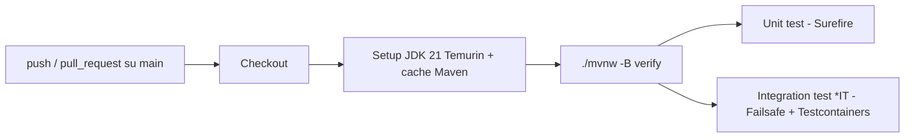

# Setup ambiente, avvio e CI/CD

Questo documento racconta come il progetto e stato portato da "repository
caricato su GitHub" a "applicazione avviata, testata end-to-end e con una
pipeline di Continuous Integration attiva". E pensato per chi clona il
repository su una macchina nuova (senza JDK, Maven o Docker) e deve arrivare
ad avere l'app in esecuzione nel minor numero di passi possibile.

E il terzo documento del percorso di studio consigliato (vedi
["Documentazione" nel README](../README.md#documentazione)): dopo aver letto
la panoramica del progetto, questo file porta dal "repository clonato" all'
"ambiente avviato e verificato", prima di passare all'architettura
([HLD](HLD.md)/[LLD](LLD.md)) e al codice ([GUIDA-COMPLETA](GUIDA-COMPLETA.md)).
Per i comandi di avvio "quotidiani" (a strumenti gia installati) resta
valida la sezione [Avvio rapido del README](../README.md#avvio-rapido): qui
ci si concentra su cosa serve **prima** di quel comando e perche.

---

## 1. Prerequisiti installati

| Strumento | Versione usata | Necessario per |
|-----------|----------------|-----------------|
| JDK       | Temurin 21.0.11 | Compilare ed eseguire l'applicazione |
| Maven     | 3.9.16          | Build (in alternativa al wrapper, vedi sotto) |
| Docker Desktop | 4.78.0     | Infrastruttura locale (Postgres, Kafka, MinIO) e test di integrazione |
| GitHub CLI (`gh`) | 2.94.0  | Verificare lo stato delle run di CI da riga di comando |

Su Windows l'installazione e stata fatta con **winget** (gia incluso in
Windows 11):

```powershell
winget install --id EclipseAdoptium.Temurin.21.JDK -e
winget install --id Docker.DockerDesktop -e
winget install --id GitHub.cli -e
```

Maven non ha un package winget ufficiale: e stato scaricato come zip binario
da `https://dlcdn.apache.org/maven/maven-3/<versione>/binaries/` ed estratto
in `C:\tools\apache-maven-<versione>`, con `MAVEN_HOME` e `PATH` impostati a
livello utente. In alternativa, **non serve installarlo a parte**: vedi il
punto successivo.

Dopo l'installazione, Docker Desktop richiede un primo avvio manuale
(accettazione dei termini, attivazione del backend WSL2) prima di poter usare
`docker` da riga di comando.

---

## 2. Maven Wrapper: niente Maven globale richiesto

Per non obbligare chi clona il repo a installare Maven, e stato generato il
**Maven Wrapper** (`mvnw`, `mvnw.cmd`, `.mvn/wrapper/maven-wrapper.properties`):

```bash
mvn -N org.apache.maven.plugins:maven-wrapper-plugin:3.3.2:wrapper -Dmaven=3.9.16
```

Da quel momento basta avere un **JDK 21** installato: `./mvnw` (Linux/macOS) o
`mvnw.cmd` (Windows) scaricano in autonomia la versione di Maven pinnata nelle
properties, al primo utilizzo, dentro `~/.m2/wrapper/`. E lo stesso script
usato dalla pipeline CI (vedi sezione 4), cosi la build locale e quella su
GitHub Actions usano sempre la stessa versione di Maven.

> **Nota Windows**: il file `mvnw` deve avere il bit eseguibile (`+x`) nel
> repository Git. Un checkout/commit fatto da Windows puo perderlo (il
> filesystem NTFS non ha questo concetto), facendo fallire la CI con
> `Permission denied`. Si corregge senza toccare il contenuto del file con:
> ```bash
> git update-index --chmod=+x mvnw
> git commit -m "fix: ripristina il bit eseguibile su mvnw"
> ```
> Questo e successo realmente durante il setup di questo progetto: la prima
> esecuzione della pipeline e fallita per questo motivo (vedi sezione 5).

---

## 3. Avvio dell'applicazione

I comandi per avviare infrastruttura e applicazione sono gia documentati nel
README, sezione [Avvio rapido](../README.md#avvio-rapido), e non vengono
ripetuti qui: in sintesi `docker compose up -d` per l'infrastruttura, poi
`./mvnw spring-boot:run` (o `mvnw.cmd spring-boot:run` su Windows, o `mvn
spring-boot:run` se preferisci un Maven installato globalmente). L'unica
differenza rispetto a una macchina con i tool gia pronti e che qui si parte
da zero: la sezione 1 sopra installa cio che serve, la sezione 2 spiega
perche non serve nemmeno installare Maven a parte.

Una volta che l'app e su (nel log appare `Started ProtocolloApplication in
NN seconds`), il passo successivo e verificare che l'ambiente sia davvero
integro end-to-end:

### 3.1 Verifica end-to-end (smoke test manuale)

Sequenza usata per validare il progetto dopo il primo avvio, utile da
ripetere ogni volta che si dubita dell'integrita dell'ambiente:

1. **Login** — ottenere un access token:
   ```bash
   curl -X POST http://localhost:8080/api/auth/login \
     -H "Content-Type: application/json" \
     -d '{"username":"admin","password":"admin123"}'
   ```
2. **Lettura** — `GET /api/documenti` con il token: deve restituire i 2
   documenti seminati da Flyway.
3. **Scrittura** — `POST /api/documenti`: deve restituire `201`, con
   `numeroProtocollo` assegnato e `pdfRiferimento` popolato.
4. **PDF** — `GET /api/documenti/{id}/pdf`: deve restituire un file che
   inizia con la firma `%PDF` (verificabile con `file nome.pdf`).
5. **Outbox -> Kafka** — nel log dell'app deve apparire, entro pochi secondi
   dalla creazione (il publisher e schedulato):
   ```
   OutboxPublisher - Outbox: evento N pubblicato su protocollo.documenti.protocollazione
   ```
   Verificabile anche a vista nella Kafka UI (http://localhost:8081).

Se tutti e cinque i passi vanno a buon fine, l'ambiente e considerato
integro: sicurezza, persistenza, generazione PDF, storage e messaggistica
funzionano insieme correttamente.

---

## 4. Pipeline CI (GitHub Actions)

Il [Dockerfile](../Dockerfile) builda l'immagine con `-DskipTests`, partendo
dal presupposto che "i test sono eseguiti nella pipeline CI, non qui": prima
del lavoro descritto in questo documento quella pipeline non esisteva ancora.
E stata aggiunta in
[`.github/workflows/ci.yml`](../.github/workflows/ci.yml):



Punti rilevanti:
- Il job gira su `ubuntu-latest`, che include Docker preinstallato: questo
  permette di eseguire anche i test di integrazione (`*IT`) con
  Testcontainers, non solo gli unit test.
- Si usa `./mvnw` (il wrapper, sezione 2) invece di un `mvn` di sistema:
  la versione di Maven e quindi identica a quella usata in locale.
- La cache di `actions/setup-java` (`cache: maven`) evita di riscaricare le
  dipendenze a ogni run.

---

## 5. Cronologia del setup (cosa e successo, in ordine)

Utile a chi vuole ripetere il processo o capire perche certi file esistono:

1. Verificata l'assenza di JDK/Maven/Docker sulla macchina di sviluppo.
2. Installati JDK 21, Docker Desktop e (manualmente) Maven 3.9.16.
3. Build (`mvn compile`) e unit test (`mvn test`, 13/13 superati) per
   confermare che codice e dipendenze sono coerenti con quanto descritto nel
   [README](../README.md) e in [HLD.md](HLD.md)/[LLD.md](LLD.md).
4. Generato il Maven Wrapper (sezione 2).
5. Avviata l'infrastruttura Docker e l'applicazione; eseguito lo smoke test
   end-to-end (sezione 3.1).
6. Creato il workflow di CI (sezione 4); commit e push su `main`.
7. **Prima run della CI fallita**: `./mvnw: Permission denied` (exit code
   126), perche `mvnw` era stato tracciato in Git senza il bit eseguibile.
   Corretto con `git update-index --chmod=+x mvnw` e nuovo commit.
8. Installato `gh` CLI e autenticato (`gh auth login --web`) per verificare
   lo stato delle run direttamente da terminale: seconda run completata con
   esito `success`.

---

## 6. Troubleshooting rapido

Problemi di **ambiente/toolchain/CI** (questa tabella). Per problemi
**applicativi** (401/403/429/502, PDF non trovato, schema non valido, ecc.)
vedi invece [GUIDA-COMPLETA.md, Appendice I](GUIDA-COMPLETA.md#appendice-i---esecuzione-build-e-troubleshooting).

| Problema | Causa probabile | Soluzione |
|----------|------------------|-----------|
| `./mvnw: Permission denied` in CI | Bit eseguibile perso su `mvnw` (tipico di commit da Windows) | `git update-index --chmod=+x mvnw` e commit |
| `mvnw.cmd` fallisce con `Cannot start maven from wrapper` | `powershell.exe` non nel `PATH` della sessione | Assicurarsi che `C:\Windows\System32\WindowsPowerShell\v1.0` sia nel `PATH` |
| `docker` da riga di comando non risponde dopo l'installazione | Docker Desktop non ancora avviato/inizializzato | Avviare Docker Desktop, accettare i termini, attendere l'icona stabile |
| Test `*IT` saltati con `mvn test` | Comportamento voluto: Surefire esclude `*IT`, solo Failsafe (`mvn verify`) li esegue | Usare `mvn verify` (o `mvnw verify`) quando serve eseguirli |
